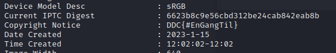

# Exiftrering af data

The challenge titel says it all. Use the exiftool command on kali to extract the exif data in the image.
`exiftool Cyberlandsholdet.jpeg`

And scrolling a bit down, you will easily be able to see the flag.
