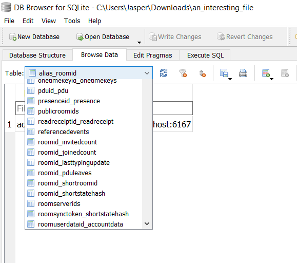
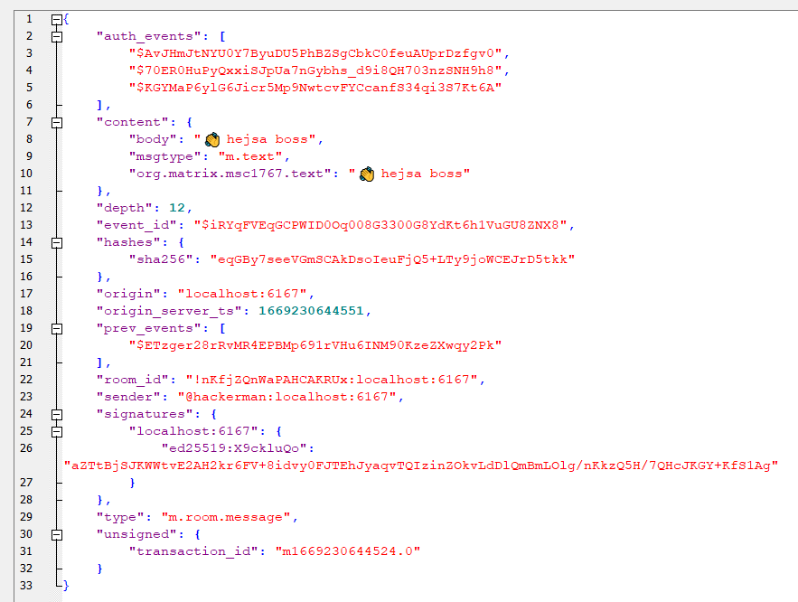
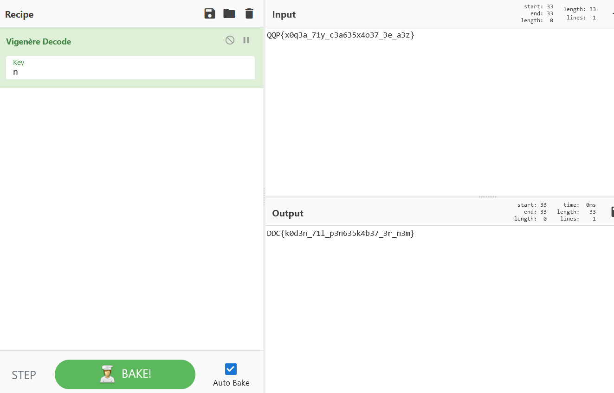

# Hackerboss: en usikker samtale

I started by opening the given file in notepad to check the format, I was using windows for this challenge. In notepad however, i saw at the top that it had "SQLite format 3" written, with everything else basically being unreadable. So i tried opening it using an [SQLite database browser](https://sqlitebrowser.org/) and it worked, it loaded in as an sqlite database.

I started looing through the different tables in the database hoping for something useful.



Then i came across the table named "pduid_pdu", where it seemed to have chat entries in that particular table.



So now i just started from the top going down each entry, and got a chat exchange. I connected the chats and got this chat exchange:

```
Hackerman: 👋 hejsa boss

Hackerboss: Hvad nu?

Hackerman: jeg ville bare lige høre hvad det nu er koden til pengeskabet er...

Hackerman: 😅

Hackerboss: Er du komplet idiot?

Hackerman: Hvad nu?

Hackerman: ¯\_(ツ)_/¯

Hackerboss: Du kan sgu da ikke spørge mig om den slags i en ukrypteret chat!

Hackerman: hvorfor ik

Hackerboss: Det kunne jo være at politiet opdager hvilken server vi bruger, og nakker harddisken.

Hackerman: ej, kan du ikke bare lige sige det?

Hackerboss: Okay så, men så krypterer jeg den altså her: QQP{x0q3a_71y_c3a635x4o37_3e_a3z}
```

So it looks like QQP{x0q3a_71y_c3a635x4o37_3e_a3z} is our encrypted flag. So let's use [CyberChef](https://gchq.github.io/CyberChef) to try and decrypt it.

It looks like a substitution encryption, like a caesar cipher. So i tried the Vigenère Decode recipe, and just randomly inputted letters and got lucky at letter "n" which made the flag look correct.



So the flag is **DDC{k0d3n_71l_p3n635k4b37_3r_n3m}**
