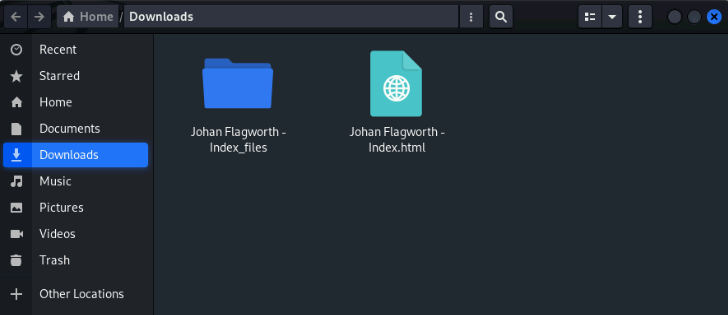
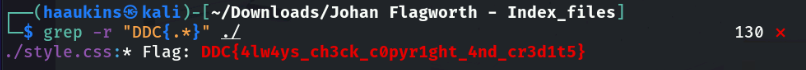

# Private Comments

I thought this site would be having a flag in it's source code, or at least the source code we can see. So i decided to just download the whole page, in firefox you can press CTRL+S or go into the burger menu and select "Save page as". Save it somewhere you can easily access it.

So now you should have the main page html file, and a folder with javascript, css, images etc. I moved the main page html file into that folder so i only need to search for a flag in that folder. To search for the flag, i use the grep command in linux.
`grep -r "DDC{.*}" ./``
This command uses the recursive flag (-r) to iterate over all files and search for the flag pattern.

And my initial assumption was correct, the flag were hidden in a css file.
**DDC{4lw4ys_ch3ck_c0pyr1ght_4nd_cr3d1t5}**
