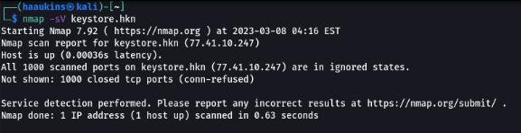
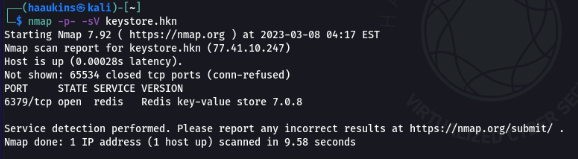

# The Key-Store Version

I have solved the challenge in the Haaukins VM. The challenge description says to find the key-value store server name and version in order to craft the flag. This sounds like a quick nmap scan challenge, so let's spin up a terminal and start the scan.

`nmap -sV keystore.hkn`
I use the -sV flag to specify that we want the versions of the services that the remote machine is hosting.

And we found nothing. A hint is given in the challenge description saying, that not everything is in the nmap top 1000 ports. So let's scan all ports.

`nmap -p- -sV keystore.hkn`
I add the -p- flag, that basically says, scan all ports.

And there we go, we found a Redis key-value database.

Now to craft the flag we need to look at the challenge description that specifies the format.
Flag format DDC{Some key-value store version} e.g. DDC{memcached key-value store 1.0.2}

So the would be **DDC{Redis key-value store 7.0.8}**
This is exactly the same format as nmap outputs it.
