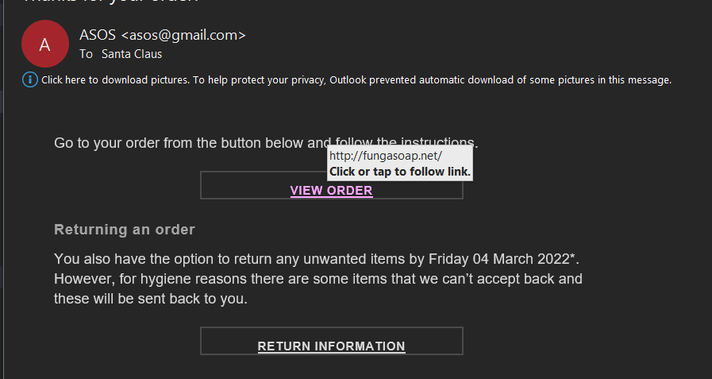
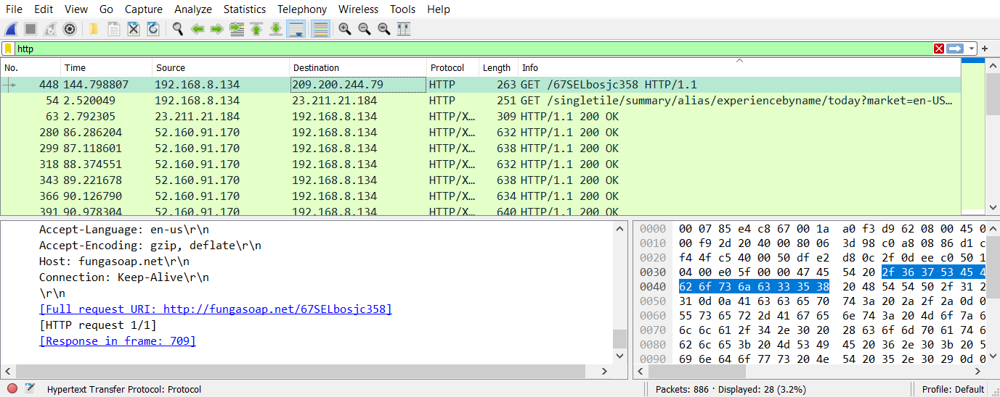

# The Santa Claus Attack

Looking through the zip folder with email exports, i looked through the different mail links to find out what santa claus clicked on. In the mail from ASOS, theres a link popping out a bit.

Fungasoap.net doesn't look like it's meant to be there. So now i will check the network dump file for entries with this link. We can analyze it using [Wireshark](https://www.wireshark.org/).

i use the "http" search filter to only get http requests. And right away on top, fungasoap.net pops up. The flag is the timestamp of this request which format should be like the following: DDC{YYYY-MM-DD-hh-mm-ss}
The timestamp of the request is Sep 19, 2016 23:10:01.871388000, so that would make the flag **DDC{2016-09-19-23-10-01}**
