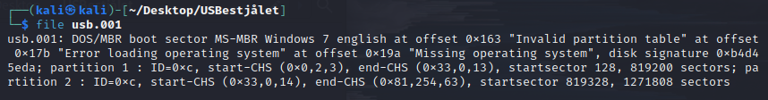
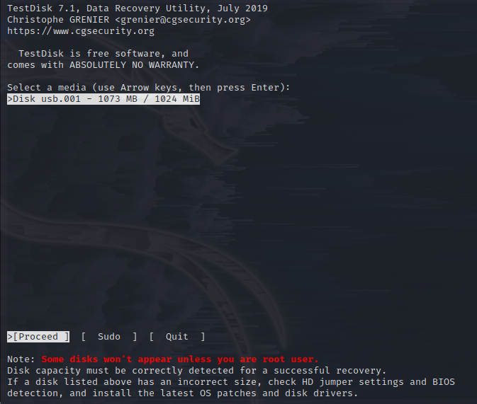
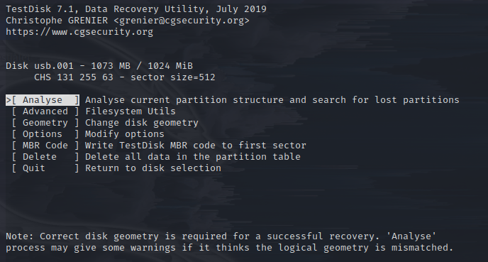
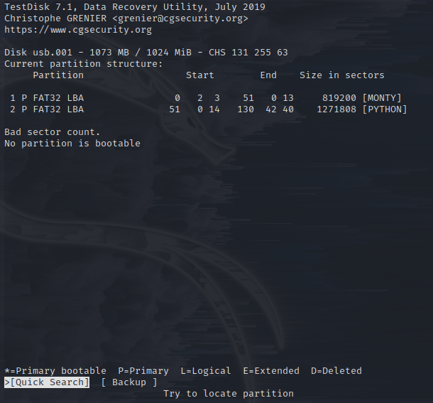
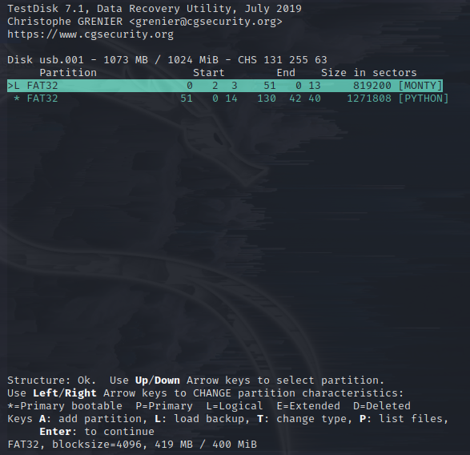
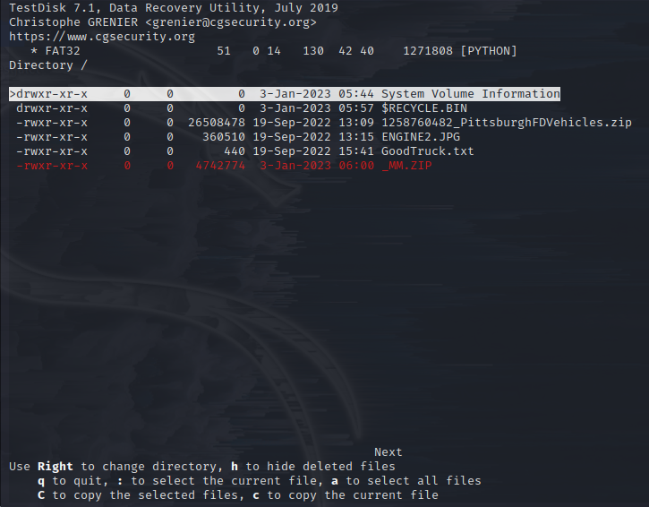
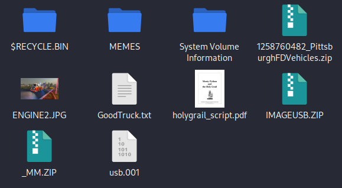
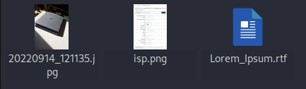
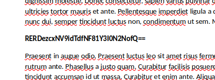
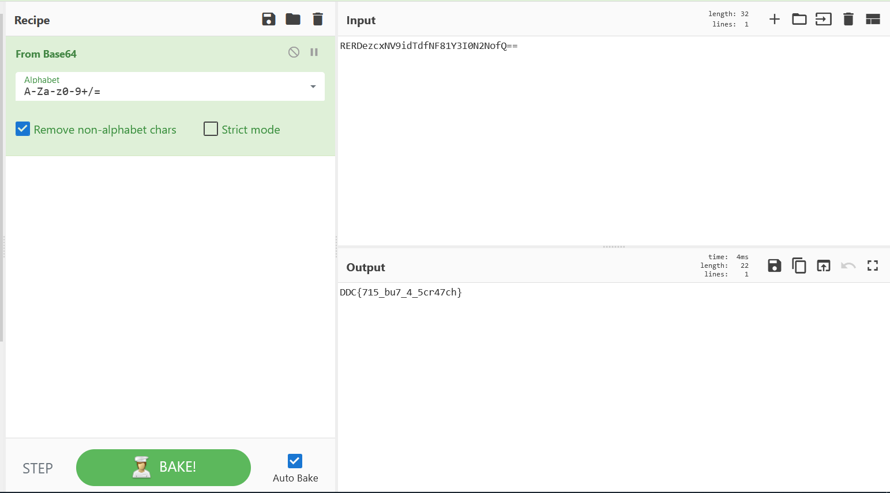

# USBestjålet

Unzip the downloaded zip folder and place it into a folder you can easily access.

First we check what file we are dealing with using the `file` command built into most linux distros.
`file usb.001`

The challange description hints that we need to find a deleted file on the USB.

Using the testdisk tool, we will be able to find the deleted file if we are lucky. Alternatively, you can use the windows tool called [Autopsy](https://www.autopsy.com/).

I will go through pretty much all the steps in testdisk to recover the files in the partitions.

`testdisk usb.001`

We can now see the usb boot sector. Select it by pressing ENTER.

Again, select the top option by pressing ENTER.

We can see that we have 2 partitions on the USB disk image. We need to perform a quick search to find all the files in both partitions.

When the partititions turn green-ish, they should be ready to pull data from. Go into a partition by selecting it with the arrow keys and press ENTER. When you are in a partition we need to use the file recovery feature. The easiest way is to press "a" in a selected partition to select all files. Then use "C" to extract all files, and then you can save the files somewhere, you can just press "c" right away to save it in the same directory as the usb.001 file.

In the image above we can see a zip folder that is marked with red. This means that the file was deleted, but can be recovered. Using the same method as for the first partition, recover all the files in the partition, and then we will take a look at the deleted file.

When looking at the recovered files, we can see the _MM.ZIP, we will unzip the file and check it's content.

Two images and an RTF file is present. Let's take a look at the RTF file first, as it's the easiest to hide data in. You can open it with libreoffice if you have it installed.

Scrolling through the file, we see something interesting.

It looks like a base64 string. We can quickly decode it using [CyberChef](https://gchq.github.io/CyberChef).

In cyberchef we make a recipe that goes from base64 to cleartext, and throw in the found base64 string and as we can see, the output is a flag.
