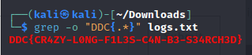

# What is logging

Download the file and place it in a folder that is easy to access with the terminal. It's a large log file we are given, so let's check if the flag is just placed somewhere in it. We can use grep to find the flag with a pattern match. I used the following command:
`grep -o "DDC{.*}" logs.txt`
This command tries to find a match that could be a flag -> DDC{XXXXXXX} and -o will make it only return the found string.

And there the flag is.
